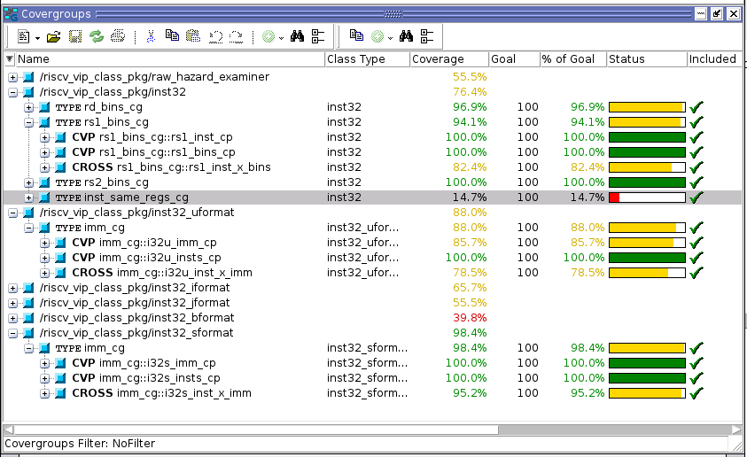
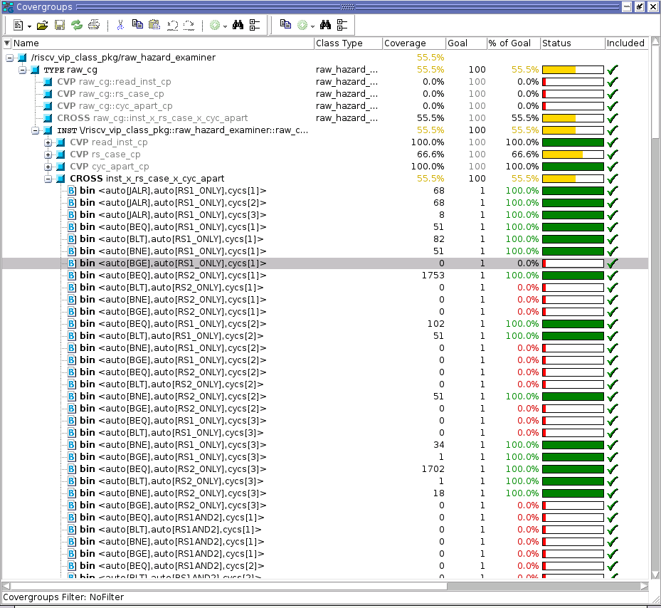

# riscv-vip-scr1-demo Overview
This repo demonstrates the RISCV-VIP integrated with the Syntacore SCR1 RISC-V core.  The RISC-V VIP adds the following capabilites:
 * instruction and register trace based on UVM
 * functional coverage based on the RISC-VIP coverage model
 * passive monitoring of instruction execution in a convienient object model for implementing your own coverage and analsysis


# riscv-vip-scr1-demo submodules
The demo uses submodules to pull in the following github repositories

submodule | github source | description
--------- | ------------- | -----------
riscv-vip | https://github.com/jerralph/riscv-vip | riscv-vip project
scr1      | https://github.com/jerralph/scr1/tree/riscv-vip-demo | fork of scr1 with riscv-vip instantiation and connections on riscv-vip-demo branch
riscv-compliance | https://github.com/riscv/riscv-compliance | RISC-V Foundation compliance test suite as used by SCR1 tests.  Commit [9273836](https://github.com/riscv/riscv-compliance/commit/9273836251cc53069f9cc48543fa9c1417e98cb7) from Sept 2018.

# Getting Running

## Prerequisites

### Linux
This assumes you are running on linux

### Mentor Questa Simulator
This demo assumes you have the Questa/Modelsim simulator installed.  Other simulators may work but will require updates to the SCR1 Makefiles. 

### Clone the repository and submodules
Clone the riscv-vip-scr1-demo repo and initialize the submodules.  This assumes SSH and the clone path can be adjusted for https if you prefer. 
```
git clone git@github.com:jerralph/riscv-vip-scr1-demo.git
cd riscv-vip-scr1-demo
git submodule update --init
```

### Setup the environment variables needed by the Make process
In the root of the riscv-vip-scr1-demo repo, source the setup script:
```
. setup.sh
```

### RISC-V GCC toolchain
The RISC-V GCC toolchain is required, as documented in the SCR1 project.  [See the SCR1 project documentation](https://github.com/jerralph/scr1/tree/riscv-vip-demo#prerequisites) for specific details.  The bin directory will need to be on the PATH so the compiler can be executed durring the SCR1 make process.

## Running the simulation
For whatever reason, the make process for the SCR1 has some issues for me and repeately requires me to try and run the simulation and clean targets a few times until things are in order.  Once things are in order it works as expected.

From the root of the riscv-vip-scr1-demo repo cd to the scr1 directory and run the simulation:
```
cd scr1
```

Do iterations of the following until it runs properly (need to figure out and fix in scr1 scripting at some point so clean iterations aren't required)
```
make run_modelsim BUS=AXI ARCH=I IPIC=0 CROSS_PREFIX=riscv32-unknown-elf-
make clean
```

When it eventually runs correctly, you should see an output that looks as follows:

```
# Test passed
# ---Test: compliance_I-RF_x0-01.hex
# Test passed

...

# ---Test: compliance_I-ANDI-01.hex
# Test passed
# ---Test: compliance_I-SRL-01.hex
# Test passed
# ---Test: compliance_I-SLT-01.hex
# Test passed
# ---Test: compliance_I-LB-01.hex
# Test passed
# 
#--------------------------------------
# Summary: 51/51 tests passed
#--------------------------------------
# 
# ** Note: $finish    : /riscv-vip-scr1-demo/scr1/src/tb/scr1_top_tb_axi.sv(242)
#    Time: 515365 ns  Iteration: 1  Instance: /scr1_top_tb_axi
# End time: 14:46:08 on Jan 08,2019, Elapsed time: 0:00:16
# Errors: 0, Warnings: 8
```

## View the RISCV-VIP generated trace file

Open the scr1/build/riscv_tracker_0.log file and you should see the instructions executed and the related register values listed in the trace. 

## View the functional coverage report

After running the simulation open udbc file generated into the build director
```
vsim -viewcov coverage.ucdb
```

The Questa GUI will open.  Next ensure the covergroups view is checked via View > Coverage > Covergroups.
Explore the coverage report

The following image shows ...


This image shows ...



# Future enhancments
 * figure out and fix weird make issues that require clean sim interations
 * update things for seeing the coverage report
 * point out the details of integration and how that was done
 